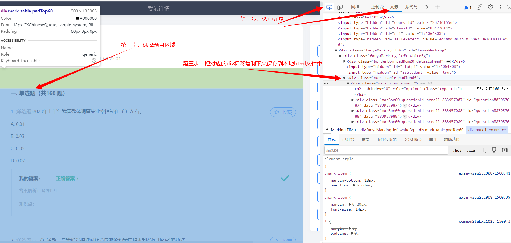
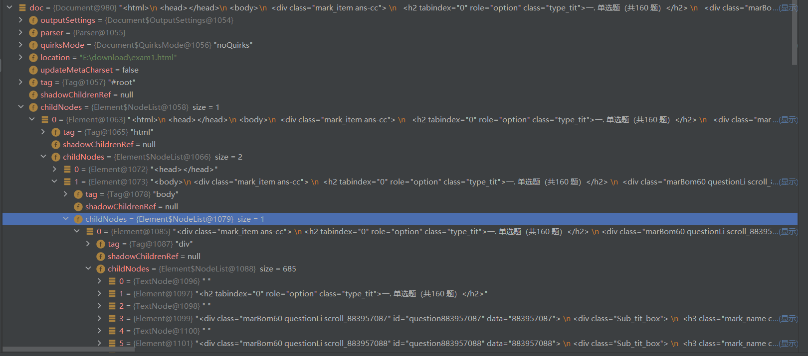

# 学习通-形势与政策题库分析程序

创建一个Maven项目，引入下面的依赖就可以用。

```xml
<dependency>
    <groupId>org.jsoup</groupId>
    <artifactId>jsoup</artifactId>
    <version>1.13.1</version>
</dependency>
```

由于不会爬虫，所以只能手动把题库对应的html文件保存到本地，然后写一段Java程序解析对应的html文件，从而得到所有题目。

得到这些题目之后就可以进行一些自定义的排序、索引等操作，方便开卷考试查找。

操作步骤：

1. 在学习通的自测中创建一个自测，选择全部的题目，进入测试后直接交卷。

2. 在网页端打开这一次的自测。F12打开控制台，选择题目对应的html

   

3. 记下来保存的位置，在代码中修改为对应的位置即可。

   ```java
   File file = new File("E:\\download\\exam1.html");
   ```

4. 代码中有些数值可能无法直接使用，因为保存下来的html文件的结构可能不同。

   不过可以先进行debug，看下对应的文档中的内容是什么样的，然后进行相应的修改。

   总体上，这个解析html的程序就是将一个div标签视为一个Node，里面的子div标签就是这个Node的子节点，就是一种多叉树的形式。

   

   比如我得到的html文件对应的doc的结构如上图所示。

   可以看到最下面的那些子节点就是题目内容了。


总体上比较简单，只需要简单进行一下debug，kk需要找到那一层就可以了。

运行结果如下：

可以自定义排序规则，也可以加上一个关键词索引。


